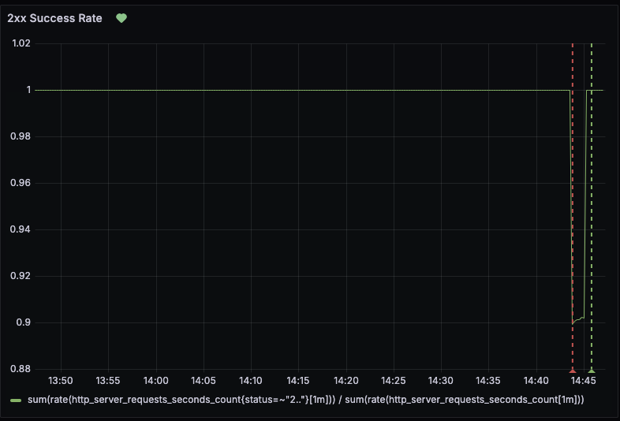
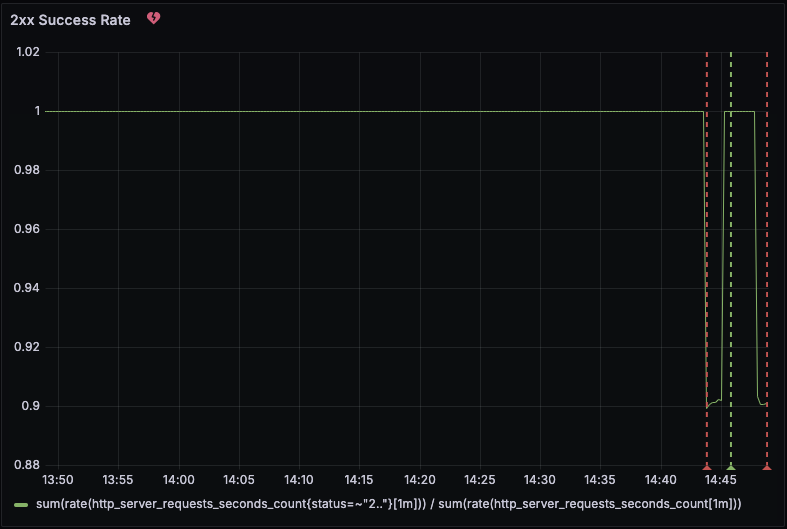
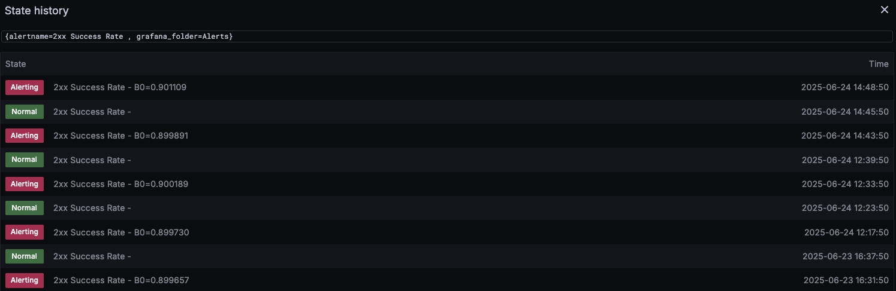

# Monitoring project with Prometheus and Grafana

## Requirements 
- Docker or Podman
- Docker compose
- wrk (to create traffic and metrics)

## Running project
```
docker compose up -d
```

## Generating metrics 
```
wrk -t 2 -c 10 -d 5m --latency "http://localhost:8080/randomStatus"
```

## Sample of Grafana Dashboards

Dashboard to real time monitoring of 200 http requests + plus normal alarm with threshold for rate below 95%




Dashboard with firing alarm


Alarm history
